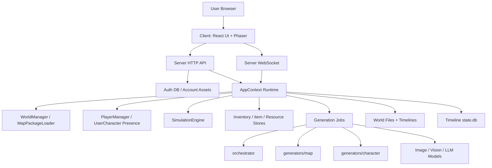
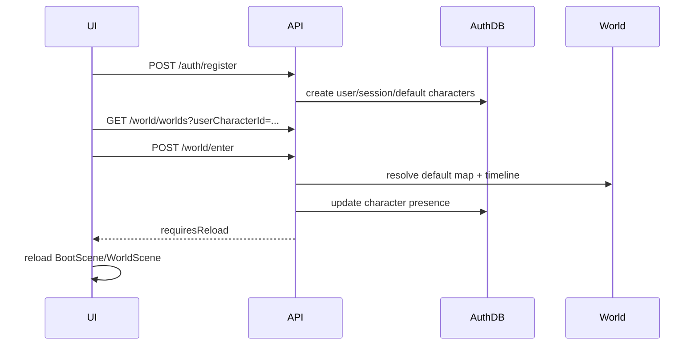

# WorldX 完整系统架构文档

本文档是 WorldX 当前技术与产品架构的主入口，合并并收口了原有工程架构、生成管线、地图节点传送、账号资产、用户角色、物品背包和多人联机等文档中的主线内容。专题文档仍保留为背景材料，但新开发应优先以本文为准。

## 1. 项目定位

WorldX 是一个 AI 驱动的可交互世界生成与模拟平台。用户登录账号后，可以：

- 创建自己的世界。
- 在世界中生成新的地图节点。
- 创建并切换自己的用户角色。
- 让角色进入任意可访问世界、时间线和地图节点。
- 与世界 NPC 对话、观看 NPC 自主行动。
- 采集资源货币，用于支付生成账号用户角色、生成世界 NPC、生成地图、生成物品等费用。
- 生成物品，放入账号背包，并在有权限的世界地图中摆放、拾取、赠送或交换。
- 邀请其他账号进入自己的世界，在同一个世界、时间线、地图节点中联机。

WorldX 的核心不是单张地图游戏，而是“账号资产 + 世界容器 + 地图节点 + 时间线分支 + 角色 presence”的组合系统。

## 2. 当前架构结论

当前主线架构如下：

- **强制登录**：未登录用户不能进入游戏主流程，不能请求世界、角色、物品、生成、时间线和 WebSocket。
- **账号是资产边界**：用户角色、资源货币、生成物品、背包、交易记录、生成世界、时间线索引属于账号。
- **世界是账号资产**：世界承载世界观、NPC、地图节点、时间线、权限和运行态。
- **地图是世界内节点**：一个世界可以有多个独立地图节点；地图节点之间通过 UI 传送，不再拼接成大图。
- **时间线是运行分支**：同一世界可以有多条时间线，每条时间线有独立 `state.db` 和 `events.jsonl`。
- **用户角色与 NPC 分离**：用户角色属于账号，NPC 属于世界；二者都可以作为 `ActorRef` 参与交互。
- **物品不是资源**：资源是账号货币，物品是 AI 生成的账号资产；采集资源不会生成背包物品。
- **多人按 PresenceScope 隔离**：在线、移动、聊天、物品摆放、交换和交互广播默认限制在 `{ worldId, timelineId, mapId }`。

旧的“大图拼接扩展、chunks、expansionExits、边缘出口点、west/north 坐标迁移”已经废弃。新的地图扩展本质是“根据用户提示词生成一个独立地图节点”。

## 3. 总体分层



### 3.1 Client

目录：`client/`

- Phaser 负责地图、碰撞、寻路、角色 sprite、相机、摆放预览。
- React 负责登录、TopBar、世界选择、时间线、建造、背包、我的角色、在线列表、NPC 对话、上帝视角等 UI。
- 二者通过 `EventBus.instance` 通信，避免 React 直接持有 Phaser 场景实例。

### 3.2 Server

目录：`server/`

- Express 提供 REST API、静态资产和 WebSocket。
- `AppContext` 是运行时依赖容器，聚合世界、NPC、用户角色、资源、物品、模拟、生成等服务。
- SQLite 分为账号库和时间线库两类。
- 生成任务通过 `child_process.spawn` 调用 orchestrator / generator 脚本。

### 3.3 Generators

目录：

- `orchestrator/`：从一句话生成世界设计。
- `generators/map/`：生成地图背景、区域标注、可行走网格、TMJ、地图包。
- `generators/character/`：生成 NPC 和用户角色 spritesheet，并执行背景裁切。

## 4. 核心领域模型

### 4.1 Account

账号是多人隔离和资产归属边界。账号数据保存在全局账号库中，不属于某个世界或时间线。

账号拥有：

- 用户角色。
- 资源货币。
- 物品定义、物品实例、背包条目和交易记录。
- 用户生成的世界。
- 可访问时间线索引。
- 账号级素材目录中的用户角色素材和物品素材。

HTTP 通过 `Authorization: Bearer <token>` 或 `worldx_session` cookie 识别账号。WebSocket 握手通过 `token` query 参数识别账号。除 `/api/auth/*`、`/api/health` 等公开入口外，游戏 API 都需要登录。

### 4.2 World

世界是账号拥有或可访问的模拟容器。世界目录位于：

```text
<WORLDX_DATA_DIR or output>/worlds/<worldId>/
library/worlds/<worldId>/
```

`library/worlds` 是源码内置示例世界；账号库、用户生成世界、账号素材和生成中间产物是运行数据，默认位于 `output/`，可通过 `WORLDX_DATA_DIR` 移到项目外部。数据清理入口是 `npm run cleanup:data`，默认 dry-run；脚本只清理运行数据，不删除 `library/worlds`。

世界目录包含：

```text
world.json
world-design.json
worldx.meta.json
config/
characters/
maps/
timelines/
```

`worldx.meta.json` 是世界所有权和可见性的文件级事实来源：

```json
{
  "ownerUserId": "user_xxx",
  "visibility": "private",
  "createdAt": "...",
  "updatedAt": "..."
}
```

世界权限：

- `owner`：世界目录所有者，可删除世界、管理成员、修改可见性、建造。
- `admin`：可管理成员、踢人、修改可见性、建造。
- `builder`：可进入和建造。
- `viewer`：可进入、查看、聊天、交易和采集账号资源，但不能修改世界运行态。
- `public/unlisted`：可访问但不代表拥有。

### 4.3 MapNode

地图节点是世界内的独立空间。目录结构：

```text
maps/<mapId>/
  metadata.json
  06-background.png
  background-preview.png
  background-tiles/
    manifest.json
    tile-0-0.png
  06-final.tmj
  world-fragment.json
  generation-report.json
```

每个地图节点拥有独立背景、TMJ、碰撞层、区域、mainAreaPoint、资源点、交互对象和默认出生点。地图节点之间不共享像素坐标，不要求边界连通。

`world.json` 中的地图拓扑字段：

```ts
type WorldMapNodeConfig = {
  id: string;
  name: string;
  gridX: number;
  gridY: number;
  status: "available" | "generating" | "failed";
  mapDir: string;
  previewImage?: string;
  defaultSpawnPointId?: string;
  createdAt?: string;
  source?: {
    prompt?: string;
    model?: string;
    fromMapId?: string;
  };
};
```

### 4.4 Timeline

时间线是某个世界的运行分支。每条时间线有独立目录：

```text
timelines/<timelineId>/
  state.db
  events.jsonl
  meta.json
```

时间线中保存：

- NPC 当前状态。
- 世界对象状态。
- 全局时间。
- 事件流。
- 记忆、日记、快照。
- 地图摆放实例。
- 角色交互记录。

账号库保存 `account_timeline_assets` 作为“某账号可见哪些世界时间线”的索引。

### 4.5 UserCharacter

用户角色是账号资产，不属于某个世界。用户可以拥有多个角色。角色当前位置不是资产归属，而是 presence：

```ts
type UserCharacterPresence = {
  characterId: string;
  worldId: string;
  timelineId: string;
  currentMapId: string;
  x: number;
  y: number;
  isOnline: boolean;
};
```

用户角色基础资料、外观和素材属于账号。当前账号创建时会固定创建两个默认角色：

- `默认男角色`
- `默认女角色`

用户也可以在“我的角色”面板生成新角色。用户角色生成会扣账号资源，调用角色素材生成管线，输出到账号级素材目录。

用户角色生成入口只在“我的角色”面板，不走建造面板，也不写入世界 NPC 配置。

### 4.6 NPC

NPC 属于世界内容，由世界生成管线创建。NPC 配置和素材在世界目录中：

```text
config/characters/<charId>.json
characters/<charId>/spritesheet.png
```

NPC 的运行态在时间线 DB 的 `character_states`，由 `SimulationEngine` 驱动。NPC 不属于任何账号，不进入账号用户角色表。

建造面板中的“生成 NPC”入口也属于世界内容生成：`POST /api/build/character` 会消耗当前账号资源，但产物写入当前世界的 NPC 配置和素材目录，不会进入“我的角色”列表。

### 4.7 ActorRef

用户角色和 NPC 都是可交互行动者：

```ts
type ActorRef = {
  actorType: "user_character" | "npc";
  actorId: string;
};
```

对话、赠送、交易、协助、冲突、检查等后续交互都应基于 `ActorRef`，避免把系统写死成玩家或 NPC 单一路径。

### 4.8 PresenceScope

多人联机房间边界：

```ts
type PresenceScope = {
  worldId: string;
  timelineId: string;
  mapId: string;
};
```

以下行为都按同一 `PresenceScope` 限制：

- 在线列表。
- 用户角色加入/离开/移动。
- 公屏聊天。
- NPC 聊天和对话广播。
- 地图物品摆放、拾取。
- 物品赠送、交易。
- ActorInteraction 创建和更新。

## 5. 文件与数据存储

### 5.1 全局账号库

位置：`<WORLDX_DATA_DIR or output>/auth.db`

主要表：

- `auth_users`
- `auth_sessions`
- `account_user_characters`
- `account_user_character_presence`
- `account_resources`
- `account_world_assets`
- `account_world_members`
- `account_timeline_assets`
- `account_item_definitions`
- `account_item_instances`
- `account_inventory_entries`
- `account_item_transfers`

账号库保存跨世界资产和账号级索引。用户角色素材、物品素材存放在：

```text
<WORLDX_DATA_DIR or output>/account-assets/user-characters/
<WORLDX_DATA_DIR or output>/account-assets/items/
```

通过 `/assets/account/...` 访问，并按登录账号校验。

### 5.2 时间线 DB

位置：`<WORLDX_DATA_DIR or output>/worlds/<worldId>/timelines/<timelineId>/state.db`

主要表：

- `events`
- `memories`
- `character_states`
- `world_object_states`
- `world_global_state`
- `diary_entries`
- `snapshots`
- `llm_call_logs`
- `map_item_placements`
- `actor_relationships`
- `actor_interactions`
- 旧兼容表：`player_avatar`、`user_characters`、`user_character_runtime`、`item_*`

当前主线已把账号资产迁到账号库；世界 DB 主要保留世界/时间线运行态，尤其是地图摆放位置，因为摆放位置属于某个世界、时间线和地图节点。

### 5.3 静态资产访问

资产路由：

- `/assets/worlds/<worldId>/...`：按世界访问权限校验。
- `/assets/maps/<mapId>/...`：旧兼容路径，优先当前运行世界上下文。
- `/assets/characters/...`：旧兼容路径。
- `/assets/account/...`：按账号资产所有权校验。

Phaser 和 DOM `` 无法总是附带 Authorization header，所以前端对需要认证的资产 URL 会附加当前 session token 查询参数。

## 6. 世界生成流程

### 6.1 用户创建世界

入口：

```http
POST /api/worlds/create
```

流程：

1. 前端提交用户提示词。
2. 服务端 `CreateJobManager` 创建异步 job。
3. Orchestrator 把提示词扩展为 `world-design.json`。
4. 地图生成管线生成 `map_origin`。
5. NPC 生成管线生成 NPC 配置和 spritesheet。
6. 服务端写入 `worldx.meta.json`，归属当前账号。
7. 写入 `account_world_assets`。
8. 前端进入新世界：`POST /api/world/enter { worldId, userCharacterId }`。
9. 角色 presence 更新到新世界默认地图节点，前端刷新运行时。

### 6.2 世界设计

`world-design.json` 是生成层和运行时之间的核心契约，包含：

- 世界名称、描述、语言、风格。
- 地图计划。
- NPC 列表、人设、外观、目标。
- 区域和交互对象。
- 世界动作和社会语境。
- 场景时间配置。

### 6.3 地图生成管线

地图生成是六步管线：

1. **Step 1 地图背景生成**：使用 `IMAGE_GEN_MODEL` 文生图，生成无人物、可俯视、道路连通的地图背景。
2. **Step 2 压缩**：压缩生成图，降低后续图像编辑和视觉审查成本。
3. **Step 3 区域标注**：图像模型在地图上用指定颜色标注功能区域，程序通过颜色 diff 提取坐标。
4. **Step 3.2 元素标注**：同样用颜色标注可交互元素和资源对象。
5. **Step 4 可行走标注**：图像模型用纯青色标注可走区域。
6. **Step 5/6 网格与输出**：程序将青色标注转为 collision tilelayer，生成 TMJ、背景瓦片、`world-fragment.json`。

图像模型当前配置为：

```env
IMAGE_GEN_MODEL=MaaS_Ge_2.5_flash_image_20251002
```

视觉审查模型由 `VISION_MODEL` 配置。推理和结构化设计由 `ORCHESTRATOR_MODEL` 或相关 LLM client 配置。

### 6.4 角色与 NPC 生成管线

用户角色和 NPC 都复用 `generators/character/` 的 spritesheet 生成能力，但归属和入口不同。生成结果不是普通头像，而是可行走 spritesheet：

- 使用固定参考模板约束 6x5 帧布局。
- 图像模型按角色描述编辑模板。
- 抠图使用边缘 flood fill，只移除连接到边缘的背景色，避免误删衣物。
- 输出 `spritesheet.png` 和外观 metadata。

- 用户角色生成：入口是“我的角色”面板和 `/api/user-characters`，产物写入账号级资产目录，记录到 `account_user_characters`。
- 世界 NPC 生成：入口是建造面板“生成 NPC”和 `/api/build/character`，请求必须携带当前操控的 `userCharacterId`。服务端通过该用户角色的 `PresenceScope` 定位唯一的 `worldId/timelineId/mapId`，校验账号在该世界拥有 `owner/admin/builder` 权限后，才把产物写入目标世界的 `characters/` 与 `config/characters/`。该入口不允许回退到服务器全局 active world，避免 NPC 串入其他世界。

NPC 生成完成后，前端会广播 `npc_roster_changed` 和 `scene_sync_characters`：Phaser 场景立即重新拉取 NPC 列表并加载新 NPC spritesheet，公屏聊天面板立即刷新 @ 候选，不再依赖整页刷新。

### 6.5 物品生成管线

物品生成入口：

```http
POST /api/items/generate
body: { userCharacterId, prompt }
```

流程：

1. 校验当前账号拥有 `userCharacterId`。
2. 校验并扣除账号资源。
3. 结构化生成物品定义：名称、描述、类别、可摆放性、footprint、阻挡、交互提示、素材 prompt。
4. 调用图像 API 生成透明背景 PNG。
5. 边缘背景移除、透明空边裁切。
6. 写入账号级物品定义、实例、背包条目和交易审计。
7. 失败则退款，不写入半成品，不生成文字牌或 SVG 兜底。

物品类别不应限制为中文枚举；生成器会把模型输出归一化到系统类别。

## 7. 地图节点系统

### 7.1 为什么不拼大图

旧拼接扩展会导致：

- WebGL 纹理尺寸和显存问题。
- 十字形扩展被迫落入包围矩形，产生空洞。
- west/north 需要迁移所有旧坐标。
- 玩家、NPC、物品、事件、资源、TMJ 坐标都容易错位。
- 地图越扩越大，角色比例、小地图和加载速度失控。

因此当前扩展不是“扩图”，而是“生成新地图节点”。

### 7.2 地图 UI 传送

玩家在建造/地图 UI 中看到世界已有地图节点。点击已有节点：

```http
POST /api/world/map/enter
body: { userCharacterId, mapId }
```

服务端只更新该用户角色的 presence：

- `worldId`
- `timelineId`
- `currentMapId`
- `x/y`
- `mainAreaPointId`

它不需要把所有用户都传送，也不需要修改全局 `activeMapId` 作为业务事实。前端收到 `requiresReload: true` 后刷新或重启场景，让 Phaser 重新加载目标地图资源、碰撞和小地图。

### 7.3 生成新地图节点

入口沿用兼容路径：

```http
POST /api/build/map/expand
body: { prompt, userCharacterId }
```

但语义已经变为“根据用户提示词生成新地图节点”。不再需要 direction、exitPointId、边界条带、边缘联通评分。

`userCharacterId` 是必填作用域锚点。服务端通过该角色的 presence 找到目标世界和当前地图节点，以该地图作为风格参考，并只把新地图节点写回这个世界的 `config/world.json`。地图节点生成不能使用服务器全局 active world，否则多人和多世界场景下会把节点加到错误世界。

流程：

1. `BuildPanel` 校验资源是否足够。
2. `BuildPanel` 提交当前操控的 `userCharacterId`。
3. 服务端通过 `PresenceScope` 校验目标世界权限，扣除资源并创建 job。
4. `generate-map-node.mjs` 读取目标世界风格、当前地图节点和用户 prompt。
5. 生成一个独立地图包到临时目录。
6. 视觉审查和程序化验证通过后 rename 到正式 `maps/<mapId>/`。
7. `MapExpander` 直接更新目标世界的 `mapNodes/mapSpawnPoints/mapLinks`。
8. 前端广播 `map_nodes_changed`，建造面板、世界上下文和小地图重新拉取地图节点状态。
9. 失败则清理临时目录并退款。

### 7.4 程序化验证

地图节点验证重点：

- 背景、TMJ、背景瓦片 manifest 存在。
- TMJ 尺寸、tileSize、collision layer 合法。
- 可行走比例合理。
- 默认出生点在可走区域。
- `world-fragment.json` 至少有 location 和 mainAreaPoint。
- 资源/对象坐标在地图范围内。

## 8. 运行时模拟

### 8.1 Tick 推进

入口：

```http
POST /api/simulation/tick
body: { worldId, timelineId, userCharacterId? }
```

账号化后，tick 请求会带 `userCharacterId`。服务端先校验角色归属和世界访问权限，再把模拟运行时对齐到该角色所在世界/时间线，避免前端请求的角色上下文和服务端全局上下文不一致导致 409。

公共默认世界是单 timeline 公共运行分支。任一在线用户点击“开始运行”后，服务端只执行同一个 `{ worldId, timelineId, mapId }` 的 tick，并把 `simulation_status`、`simulation_events` 和高光事件按 PresenceScope 广播给同一公共世界内的所有在线客户端。触发 tick 的客户端使用 HTTP 响应播放结果，其他客户端使用 WebSocket 收到的同一批事件播放结果；并发 tick 请求会被 409 拒绝，避免公共世界被多端重复推进。

每个 tick：

1. `WorldManager.advanceTick()` 推进时间。
2. `CharacterManager.tickPassiveUpdate()` 更新 NPC 被动状态。
3. 清理失效对话。
4. `Perceiver` 构建每个 NPC 可见上下文。
5. `ActionMenuBuilder` 构建可行动作。
6. `DecisionMaker` 调用 LLM 决策。
7. `ActionExecutor` 执行动作。
8. `DialogueGenerator` 处理对话。
9. 写入事件、记忆、日记和 `events.jsonl`。
10. 通过 EventBus 和 WebSocket 广播运行状态。

### 8.2 感知与记忆

NPC 不是全知视角。决策上下文包含：

- 当前 location 和 mainAreaPoint。
- 同区域可见角色。
- 附近交互对象。
- 最近事件。
- 自己近期行为摘要。
- 检索到的相关记忆。

记忆检索采用可解释评分，而不是强依赖 embedding：

```text
score = relevance * 3 + recency * 2 + importance * 2 + emotionalIntensity
```

### 8.3 时间线与回放

`TimelineManager` 管理时间线目录、`state.db` 和 `events.jsonl`。运行时会记录：

- init frame：角色初始位置。
- tick frame：每 tick 产生的事件。

前端 Replay 模式读取时间线事件，以事件播放方式复现历史，而不是重新模拟。

### 8.4 上帝视角与干预

上帝视角是观察/管理工具，不再是玩家化身模式。当前支持：

- 广播世界事件。
- 对单个 NPC whisper。
- 角色详情和部分运行态编辑。
- 架空对话。

## 9. 用户角色控制

### 9.1 进入世界

入口：

```http
POST /api/world/enter
body: { worldId, userCharacterId }
```

流程：

1. 校验账号能访问世界。
2. 如果是 `library/worlds` 默认世界，直接进入共享公共世界，不创建账号私有副本；所有已登录账号拥有 builder 权限。
3. 如果是用户生成世界，按 owner/member/visibility 权限解析访问范围。
4. 解析该世界默认地图节点，优先 `map_origin` 或可用节点。
5. 解析目标世界的时间线：默认公共世界固定只有一条共享时间线，不能新建或删除；用户生成世界按 owner/member 规则隔离或共享。
6. 更新用户角色 presence。
7. 准备地图 runtime 和资源节点。
8. 返回 `requiresReload: true`。

### 9.2 切换角色

入口：

```http
POST /api/user-characters/:id/select
```

切换角色不等于切世界。当前实现会尽量把目标角色放到来源角色所在世界、时间线、地图，从而允许前端轻量切换本地控制器而不刷新整页。旧角色会广播离线/离开，避免地图残留旧用户角色和名字。

### 9.3 前端控制器

Phaser 中：

- `UserCharacterController` 控制本地用户角色。
- `RemoteUserCharacterManager` 渲染其他在线用户角色。
- NPC 仍由 `WorldScene` 的角色 sprite / `CharacterMovement` 管理。

本地用户角色支持点击移动和键盘/鼠标交互。移动会通过 WebSocket/API 同步到服务端 presence，并广播给同 scope 玩家。

## 10. 资源系统

资源是账号货币，不是背包物品。用途：

- 生成账号用户角色。
- 生成世界 NPC。
- 生成地图节点。
- 生成物品。
- 后续付费建造和其他系统。

资源采集流程：

1. `ResourceManager` 从当前地图 TMJ 交互对象和 `world.json/world-fragment` 发现资源点。
2. 前端使用地图上的可交互对象 hit zone，而不是额外绘制独立资源素材。
3. 用户角色靠近资源点时显示采集按钮。
4. 点击后调用：

```http
POST /api/build/collect
```

5. 服务端按账号增加资源余额，前端刷新 TopBar。

当前已取消前端两秒 CD 限制；服务端仍可根据资源点配置决定冷却策略。

## 11. 物品、背包与摆放

### 11.1 账号背包

背包主数据是账号维度，不跟随某个角色。用户角色只是当前操作入口。

核心表：

- `account_item_definitions`
- `account_item_instances`
- `account_inventory_entries`
- `account_item_transfers`

背包 UI 是格子状，显示物品图片和名称。点击格子显示：

- 摆放。
- 使用。
- 丢弃/删除。
- 赠送。
- 交换。

### 11.2 地图摆放

摆放位置属于世界/时间线/地图运行态，保存在当前时间线 DB 的 `map_item_placements`。

摆放 API：

```http
POST /api/items/place
body: { userCharacterId, entryId, x, y, rotation?, footprintTiles?, visualScale? }
```

服务端校验：

- 当前账号拥有物品。
- 当前账号对目标世界有 builder/admin/owner 权限。
- `footprintTiles` 在地图内。
- `footprintTiles` 所有 tile 可走。
- 不与已有阻挡摆放物重叠。
- `visualScale` 是 `0.5x - 3x` 的等比例视觉缩放，写入 placement metadata；它只影响渲染和多人同步，不改变 footprint、碰撞或寻路阻挡。

摆放物阻挡使用动态 placement collision，不修改原始 TMJ collision。前端加载摆放物后，把阻挡 footprint 写入 MapManager 动态阻挡网格，刷新寻路。

### 11.3 拾取和权限

拾取 API：

```http
POST /api/items/pickup
```

只有摆放归属账号或有管理权限的账号可以拾取/收回。其他玩家看到的是归属提示，不显示收回按钮。

### 11.4 赠送与交易

同一 `PresenceScope` 内在线玩家可以发起：

- 单向赠送。
- 双向交换。

交易确认后，物品实例和定义的账号归属会迁移到接收账号，避免接收方拿到实例但没有素材访问权。

## 12. 多人联机

### 12.1 WebSocket 握手

WebSocket 通过 token 绑定账号，通过 selected user character 绑定当前角色。连接后服务端维护：

- `playerId` / `userCharacterId`
- `userId`
- `worldId`
- `timelineId`
- `mapId`
- `name`

### 12.2 广播事件

主要事件：

- `user_character_joined`
- `user_character_left`
- `user_character_moved`
- `user_characters_online`
- `user_character_presence_changed`
- `map_item_placed`
- `map_item_picked_up`
- `item_transfer_requested`
- `item_transfer_completed`
- `item_transfer_cancelled`
- `actor_interaction_started`
- `actor_interaction_updated`
- `world_invite_received`
- `world_invite_accepted`
- `world_invite_declined`

旧 `player_*` 事件已从主运行路径退出。

### 12.3 在线列表与邀请

`OnlinePlayersPanel` 使用：

```http
GET /api/world/online?userCharacterId=...
```

返回当前世界在线玩家、全平台在线玩家、当前账号管理权限和成员信息。房主或管理员可以在在线面板中向任意在线玩家发送实时世界邀请；对方收到弹窗并接受后，服务端写入世界成员授权，前端自动把对方当前用户角色送入该世界。旧的邀请码和分享链接入口已废弃。

```http
POST /api/world/online/invite
body: { userCharacterId, targetPlayerId, role?: "viewer" | "builder" | "admin" }

POST /api/world/online/invites/:inviteId/respond
body: { accepted, userCharacterId? }
```

成员列表仍支持查看和移除；不再通过复制链接或手动输入账号 ID 作为主要邀请流程。

房主切换地图节点不会强制其他玩家跟随；每个用户角色 presence 独立。其他人仍留在自己的 `{ worldId, timelineId, mapId }`，除非他们自己传送或被后续房间规则带走。

## 13. 客户端工作原理

### 13.1 启动流程

1. React 检查登录状态。
2. 未登录时显示登录页，不允许进入主游戏。
3. 登录后读取当前 selected user character。
4. `BootScene` 请求角色 manifest、当前世界信息、当前地图资源路径。
5. 加载 TMJ、背景、背景瓦片、NPC spritesheet、用户角色素材。
6. 进入 `WorldScene`。
7. React UI 加载世界列表、时间线、资源、背包、在线状态。
8. WebSocket 连接并加入当前 presence scope。

### 13.2 Phaser 场景

`BootScene`：

- 解析 active map asset prefix。
- 加载 `06-final.tmj`。
- 加载 `06-background.png` 或背景瓦片。
- 加载角色 spritesheet。

`WorldScene`：

- `MapManager` 解析 TMJ、collision、区域和交互对象。
- `PathfindingManager` 初始化 EasyStar 网格。
- `CharacterMovement` 管理 NPC 移动。
- `UserCharacterController` 管理本地用户角色。
- `RemoteUserCharacterManager` 管理远端用户角色。
- `PlaybackController` 管理 tick 和 replay。
- 物品摆放层和资源交互层挂载在地图上。

### 13.3 React UI

关键面板：

- `TopBar`：世界、时间线、运行状态、资源、入口按钮。
- `JoinGate`：选择世界和用户角色进入。
- `UserAccountPanel`：登录、注册、退出和账号信息。
- `UserCharactersPanel`：角色格子、生成、切换、删除。
- `InventoryPanel`：背包格子、生成物品、摆放、删除、赠送、交换。
- `BuildPanel`：生成地图节点、查看地图节点。
- `OnlinePlayersPanel`：在线列表、邀请、成员管理、踢出。
- `PublicChatPanel`：同 scope 公屏聊天。
- `GodPanel`：管理和干预工具。

### 13.4 EventBus

React 与 Phaser 通过 `EventBus.instance` 传递：

- `set_auto_play`
- `dev_advance_tick`
- `local_user_character_changed`
- `begin_item_placement`
- `cancel_item_placement`
- `map_item_placed`
- `map_item_picked_up`
- `resource_collected`
- `build_state_updated`
- `simulation_status`

`WorldScene` 必须在 shutdown 时清理 Scene 级事件监听，避免切世界/切角色后旧场景继续发 tick 或残留远端角色。

## 14. 服务端模块划分

### 14.1 AppContext

`server/src/services/app-context.ts`

运行时依赖容器，负责：

- 初始化世界和时间线。
- 构建 `WorldManager`、`CharacterManager`、`PlayerManager`、`ResourceManager`、`SimulationEngine` 等。
- 切换世界/时间线。
- 管理 EventBus。
- 同步 active map runtime resources。

### 14.2 WorldManager

`server/src/core/world-manager.ts`

职责：

- 读取世界配置和当前地图 fragment。
- 加载 TMJ collision。
- 管理时间、场景配置、location、mainAreaPoint。
- 查询可行走点和出生点。
- 管理世界对象状态。
- 初始化和维护 `mapNodes`。

### 14.3 MapPackageLoader

`server/src/core/map-package-loader.ts`

职责：

- 不切全局运行时地读取任意世界/地图节点包。
- 提供地图节点状态。
- 读取地图 spawn、locations、resource nodes。
- 给账号 scoped API 使用，避免被服务端全局 worldDir 带偏。

### 14.4 PlayerManager

`server/src/core/player-manager.ts`

历史名称仍叫 PlayerManager，但主职责已经是用户角色 runtime 管理：

- 创建默认用户角色。
- 创建用户角色。
- 查询和更新 presence。
- 进入地图。
- 上下线状态。
- 与旧 `player_avatar` 兼容。

### 14.5 ResourceManager

`server/src/core/resource-manager.ts`

职责：

- 发现当前地图资源节点。
- 读取/写入账号资源货币。
- 执行采集。
- 提供建造成本配置。

### 14.6 ItemGenerator 与 Inventory Store

`server/src/core/item-generator.ts` 和 `server/src/store/inventory-store.ts`

职责：

- 生成结构化物品定义。
- 调用图像模型生成透明 PNG。
- 写入账号物品资产。
- 查询背包。
- 摆放、拾取、删除、丢弃；“使用”只对显式 `metadata.usable=true` 的特殊物品开放。
- 赠送和交易。

### 14.7 MapExpander

`server/src/core/map-expander.ts`

虽然名称仍叫 Expander，但当前语义是“地图节点生成器”。职责：

- 校验权限和资源。
- 创建异步 job。
- 调用 `generate-map-node.mjs`。
- 合并新地图节点到 `world.json`。
- 失败退款。

### 14.8 SimulationEngine

`server/src/simulation/simulation-engine.ts`

职责：

- Tick 主循环。
- NPC 感知、决策、执行。
- 对话调度。
- 事件写入。
- 记忆和反思调度。

### 14.9 TimelineManager

`server/src/services/timeline-manager.ts`

职责：

- 创建、加载、删除时间线。
- 管理 `state.db` 路径。
- 记录 `events.jsonl`。
- 读取 replay frames。
- 和账号时间线索引同步。

## 15. API 分组

### 15.1 Auth

- `POST /api/auth/register`
- `POST /api/auth/login`
- `GET /api/auth/me`
- `POST /api/auth/logout`

### 15.2 World

- `GET /api/world/info?userCharacterId=...`
- `GET /api/world/time?userCharacterId=...`
- `GET /api/world/worlds?userCharacterId=...`
- `POST /api/world/enter`
- `GET /api/world/maps?userCharacterId=...`
- `POST /api/world/map/enter`
- `GET /api/world/online?userCharacterId=...`
- `POST /api/world/online/invite`
- `POST /api/world/online/invites/:inviteId/respond`
- `POST /api/world/online/kick`
- `PATCH /api/world/worlds/:worldId`
- `GET/POST/DELETE /api/world/worlds/:worldId/members`
- `DELETE /api/world/worlds/:worldId`

所有“当前世界/时间线/地图”相关查询应尽量带 `userCharacterId`，以用户角色 presence 为准，避免读取服务端全局当前世界。

### 15.3 Timeline

- `GET /api/timelines?userCharacterId=...`
- `GET /api/timelines/all`
- `POST /api/timelines`
- `POST /api/timelines/:id/load`
- `DELETE /api/timelines/:id`
- `GET /api/timelines/:id/events`

### 15.4 User Characters

- `GET /api/user-characters`
- `POST /api/user-characters`
- `POST /api/user-characters/:id/select`
- `POST /api/user-characters/:id/enter-map`
- `PATCH /api/user-characters/:id`
- `DELETE /api/user-characters/:id`

### 15.5 Build and Resources

- `GET /api/build/state?userCharacterId=...`
- `POST /api/build/collect`
- `POST /api/build/character`：生成当前世界 NPC，不创建账号用户角色。
- `POST /api/build/map/expand`
- `GET /api/build/map/jobs/:jobId`

### 15.6 Items

- `POST /api/items/generate`
- `GET /api/items/inventory?userCharacterId=...`
- `GET /api/items/placements?userCharacterId=...`
- `POST /api/items/place`
- `POST /api/items/pickup`
- `POST /api/items/delete`
- `POST /api/items/use`：仅用于 `metadata.usable=true` 的特殊物品；AI 生成摆放物默认不可使用。
- `POST /api/items/drop`
- `POST /api/items/transfer/request`
- `POST /api/items/trade/request`
- `GET /api/items/trade/candidates`
- `POST /api/items/transfer/:transferId/respond`
- `POST /api/items/transfer/:transferId/cancel`

### 15.7 Simulation

- `POST /api/simulation/tick`
- `POST /api/simulation/day`
- `POST /api/simulation/days`
- `POST /api/simulation/pause`
- `POST /api/simulation/resume`
- `POST /api/simulation/reset`
- `GET /api/simulation/status`

### 15.8 Characters and Events

- `GET /api/characters?userCharacterId=...`
- `GET /api/characters/:id`
- `PATCH /api/characters/:id/profile`
- `PATCH /api/characters/:id/runtime-state`
- `GET /api/events`
- `GET /api/events/range`
- `GET /api/events/highlights`

## 16. 关键端到端流程

### 16.1 注册与进入世界



### 16.2 切换世界

1. TopBar 读取 `GET /api/world/worlds?userCharacterId=...`。
2. 用户选择目标世界。
3. 调用 `POST /api/world/enter`。
4. 服务端更新当前用户角色 presence。
5. 前端刷新运行时。
6. 其他用户不自动跟随。

### 16.3 切换地图节点

1. BuildPanel/地图 UI 读取 `GET /api/world/maps?userCharacterId=...`。
2. 用户点击目标地图节点。
3. 调用 `POST /api/world/map/enter`。
4. 服务端更新 `currentMapId/x/y`。
5. 前端刷新 Phaser，加载目标地图包。

### 16.4 切换角色

1. UserCharactersPanel 调用 `POST /api/user-characters/:id/select`。
2. 服务端让旧角色离线，目标角色进入当前上下文。
3. WebSocket 广播旧角色离开和新角色 presence。
4. 前端轻量切换本地控制器，不需要整页刷新。

### 16.5 生成物品并摆放

1. InventoryPanel 校验资源是否足够。
2. `POST /api/items/generate` 生成物品并进入账号背包。
3. 用户点击背包格子“摆放”。
4. Phaser 进入摆放模式并显示 footprint 预览。
5. `POST /api/items/place` 服务端校验权限、footprint 和碰撞。
6. 写入 `map_item_placements`。
7. WebSocket 向同 scope 广播 `map_item_placed`。
8. 所有同图客户端重拉摆放层。

### 16.6 Tick 运行

1. TopBar 点击开始运行。
2. PlaybackController 确保 live context 就绪。
3. `POST /api/simulation/tick { worldId, timelineId, userCharacterId }`。
4. 服务端对齐到角色所在世界/时间线。
5. SimulationEngine 推进一 tick。
6. 返回事件和新时间。
7. 前端播放事件，更新 UI。

## 17. 权限与隔离原则

新增功能必须遵守：

1. 任何读写账号资产的 API 都必须有登录账号。
2. 用户角色必须校验 `userId -> characterId` 归属。
3. 世界写操作必须校验 `owner/admin/builder` 权限。
4. 删除世界只允许 owner。
5. 世界列表不能泄露其他私有世界。
6. 物品背包是账号资产，不能因为切角色丢失或复制。
7. 地图摆放属于世界时间线运行态，收回权限按摆放归属和世界管理权限校验。
8. 多人广播必须限制在 `PresenceScope`。
9. 查询当前世界/时间线/地图时，优先使用 `userCharacterId` 的 presence，不要读取服务端全局 current world。

## 18. 配置与模型

主要环境变量：

```env
ORCHESTRATOR_MODEL=...
IMAGE_GEN_PROVIDER=openai-compatible
IMAGE_GEN_BASE_URL=...
IMAGE_GEN_API_KEY=...
IMAGE_GEN_MODEL=MaaS_Ge_2.5_flash_image_20251002
VISION_MODEL=...
SIMULATION_MODEL=...
MAP_IMAGE_SIZE_K=...
```

用户角色生成、NPC 生成、地图生成和物品生成默认都应使用 `IMAGE_GEN_MODEL`。如果某个子系统需要单独模型，可使用专用变量，例如 `ITEM_ASSET_IMAGE_MODEL`，但应明确记录原因。

## 19. 当前已废弃或兼容项

废弃：

- 大图拼接地图扩展。
- `chunks`。
- `expansionExits`。
- `exitPointId`。
- west/north 坐标迁移。
- `/assets/map/...` 根地图静态路由。
- 玩家点击“化身/上帝模式”作为主玩法。

兼容但不应扩展：

- `player_avatar`：旧玩家化身镜像。
- `user_characters` / `user_character_runtime` 时间线本地表：旧兼容。
- 旧 `/api/users`：只保留账号资料兼容，不再创建真实游戏用户。
- 旧 `expand-map.mjs`：遗留拼接脚本，不作为当前生成路线。

## 20. 新功能开发检查清单

开发任何新功能前，先回答：

- 这是账号资产、世界内容、地图节点内容，还是时间线运行态？
- 是否需要 CRUD，而不只是 create？
- 是否要按 `userId` 校验资产归属？
- 是否要按 `worldId/timelineId/mapId` 限制广播？
- 是否会影响其他玩家？其他玩家能否看到、拆除、交易、拾取？
- 是否需要写入 `events` 或 `item_transfers` 做审计？
- 是否需要更新回放或时间线复制？
- 前端切角色、切世界、切地图后是否会残留旧监听或旧对象？
- 资源和物品是否被混淆？
- 如果生成失败，是否退款并避免半成品落库？

## 21. 专题文档索引

以下文档保留为专题细节或历史背景：

- `docs/generation-pipeline.md`：地图生成六步管线细节。
- `docs/map-ui-travel-system.md`：从拼接地图迁移到独立地图节点的设计过程。
- `docs/account-world-map-decoupling.md`：账号、世界、地图节点解耦规划和完成情况。
- `docs/user-character-architecture.md`：用户角色与 NPC 分离的领域模型。
- `docs/multiplayer-items-architecture.md`：物品、背包、摆放、交易和 ActorInteraction 细节。
- `docs/TECHNICAL_OVERVIEW.md`：面向外部介绍的技术概览。

当专题文档与本文冲突时，以本文的当前架构结论为准。
